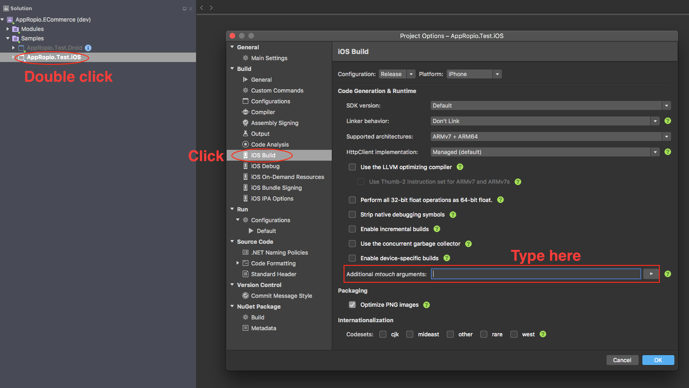
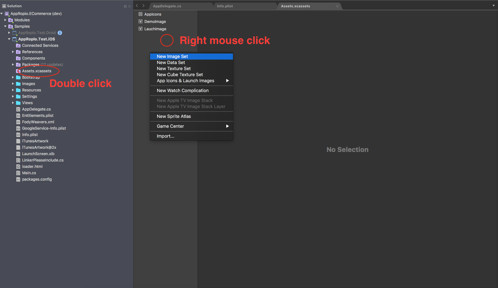

# deistviya-v-ios-proekte

* Проверить `Info.plist` \(взять необходимые свойства из списка [здесь](infoplist.md)\)
* Удалить из проекта лишние файлы \(`ViewController.cs`, `Main.storyboard`, `LaunchScreen.storyboard`\)
* Подключить dll'ки в соответствии со списком модулей и настроек \(таблицу соответствия между библиотеками и модулями можно найти [здесь](https://github.com/appropio/faq/tree/01a74964a039dfb9acb17ee3a5d97021d54f864c/perechen-bibliotek-modulei.md)\)
  * Добавить Bootstrap-файлы для каждого модуля
  * Добавить папку `Settings` с конфигурационными файлами для ядра и для темы каждого модуля
  * Подключить требуемые пакеты \(список основных пакетов можно найти [здесь](../spisok-paketov.md)\)
  * Подключить пакет иконок \(полный пакет иконок можно скачать [отсюда](https://github.com/appropio/faq/tree/01a74964a039dfb9acb17ee3a5d97021d54f864c/ru/sborka-novogo-proekta/Images.zip)\)
* Добавить в проект [LinkerPleaseInclude.cs](linkerpleaseinclude.md)
* Добавить 

  `--linkskip=MvvmCross --linkskip=MvvmCross.Core --linkskip=MvvmCross.Binding --linkskip=MvvmCross.Platform`

   в аргументы mtouch запускаемого проекта

  

* Изменить `AppDelegate` \(наследовать от `ARApplicationDelegate` и переопределить методы `CreateSetup` и `CreatePresenter` , [пример](appdelegate.md)\)
* Добавить в проект постзагрузочный индикатор \([loader.html](https://github.com/appropio/faq/tree/01a74964a039dfb9acb17ee3a5d97021d54f864c/ru/sborka-novogo-proekta/deistviya-v-ios-proekte/loader.html) со свойством `BuildAction` установленным в `BundleResource` \)
* Подключить в 

  `Assets.xcassets`

   иконки приложения для отображения на рабочем столе и в системе и загрузочный экран 

  \(

  `LaunchScreen.xib`

   с картинкой, добавленной в Assets через Image Set

  \)

  

* Проверить сборку и запуск проекта на симуляторе
* Настроить цветовую схему \([работа с темой проекта](https://github.com/appropio/faq/tree/01a74964a039dfb9acb17ee3a5d97021d54f864c/dorabotka-suschestvuyuschego-proekta/rabota-s-temoi-proekta.md)\), проверить и перекрасить пакет иконок \(иконки берутся из дизайна\)
* Запросить ApiKey и иденификатор компании \(подробная [инструкция](../zapros-litsenzii.md)\)

